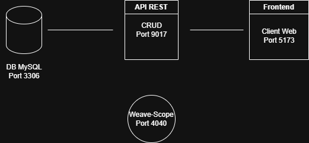

# Projet siteTkd

Ce projet est une application web dockerisée qui permet de gérer et de consulter des informations liées au Taekwondo. L'application est composée de trois services principaux : un client React, un serveur Node.js avec Sequelize pour la gestion de la base de données MySQL, et une base de données MySQL.

## Architecture

L'architecture du projet est la suivante :



### Composants principaux :
- **Client (React)** : Interface utilisateur exposée sur le port 5173.
- **Serveur (Node.js)** : Fournit des API RESTful exposées sur le port 9017.
- **Base de données (MySQL)** : Stocke les données de l'application, exposée sur le port 3306.

### Protocole de communication :
- **Client ↔ Serveur** : Requêtes HTTP (GET, POST, PUT, DELETE) avec des données JSON.
- **Serveur ↔ Base de données** : Connexion via Sequelize utilisant le protocole MySQL.

### Ports exposés :
- **5173** : Port pour le client React.
- **9017** : Port pour le serveur Node.js.
- **3306** : Port pour la base de données MySQL (non accessible depuis l'extérieur).

## Instructions

### Prérequis
- Docker et Docker Compose installés sur votre machine.
- Un compte Docker Hub pour pousser les images Docker (optionnel).

### Build et exécution du projet

1. Clonez le dépôt GitHub :
   ```bash
   git clone https://github.com/Azurhys/siteTkd.git
   cd siteTkd
   ```

2. Créez un fichier `.env` à la racine du projet pour configurer les variables d'environnement nécessaires :
   ```env
   DB_USER=root
   DB_PASSWORD=yourpassword
   DB_NAME=sitetkd
   DB_ROOT_PASSWORD=yourpassword
   ```

3. Construisez et lancez les services avec Docker Compose :
   ```bash
   docker-compose up --build
   ```

4. Accédez à l'application :
   - Client : [http://localhost:5173](http://localhost:5173)
   - API Server : [http://localhost:9017](http://localhost:9017)

### Test des fonctionnalités
#### Exemple de requêtes API :
- **GET Formules** :
   ```bash
   curl -X GET "http://localhost:9017/api/formules?federation=FFST"
   ```

- **POST Ajouter un utilisateur** :
   ```bash
   curl -X POST "http://localhost:9017/api/users" \
   -H "Content-Type: application/json" \
   -d '{"nom":"Jean","prenom":"Dupont","age":25}'
   ```

### Workflow CI/CD
Le projet inclut un workflow GitHub Actions (`.github/workflows/docker-build.yml`) pour :
- Construire et pousser les images Docker du client et du serveur sur Docker Hub.
- Exécuter les actions sur chaque push ou PR dans les branches `main` ou `dockerize`.

## Screenshots

1. **Interface utilisateur** :
   

2. **Diagramme de l'architecture** :
   

3. **Exemple de données** :
   

## Remarques

- Vérifiez que les ports nécessaires (5173, 9017, 3306) ne sont pas déjà utilisés.
- Si des erreurs surviennent lors de l'initialisation de la base de données, supprimez les volumes Docker :
  ```bash
  docker-compose down -v
  ```

## Licence
Ce projet est sous licence MIT. Voir le fichier [LICENSE](./LICENSE) pour plus d'informations.

